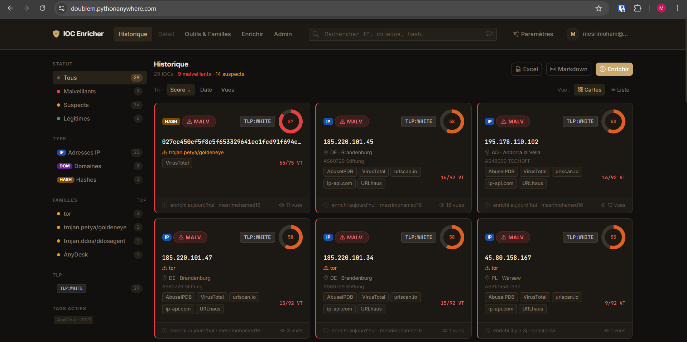
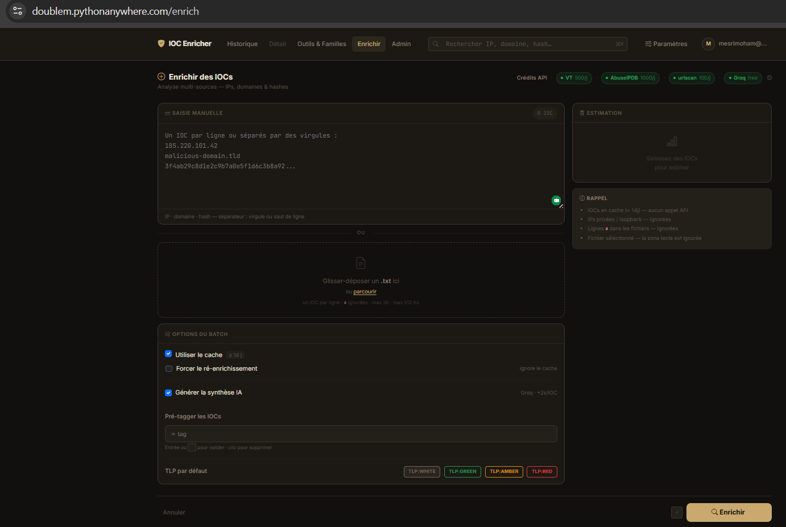
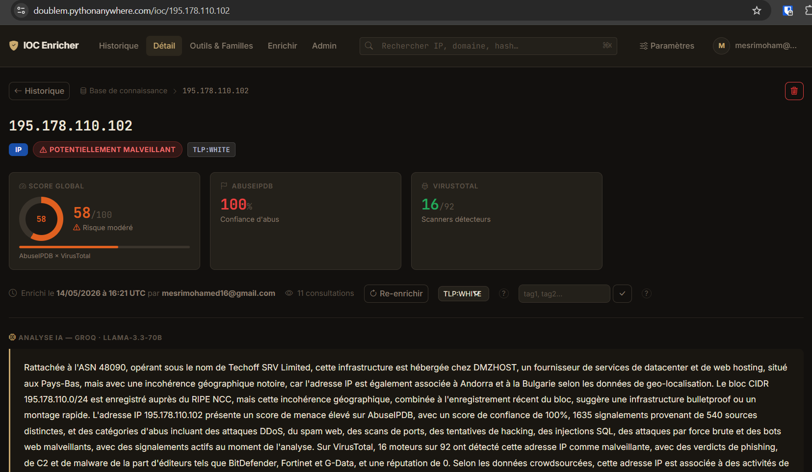
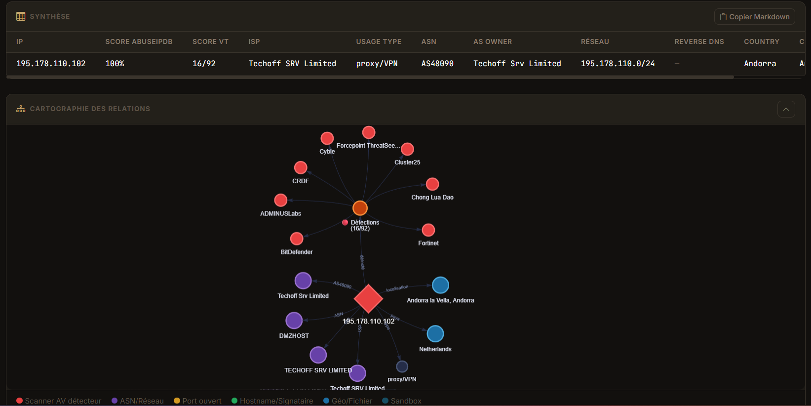
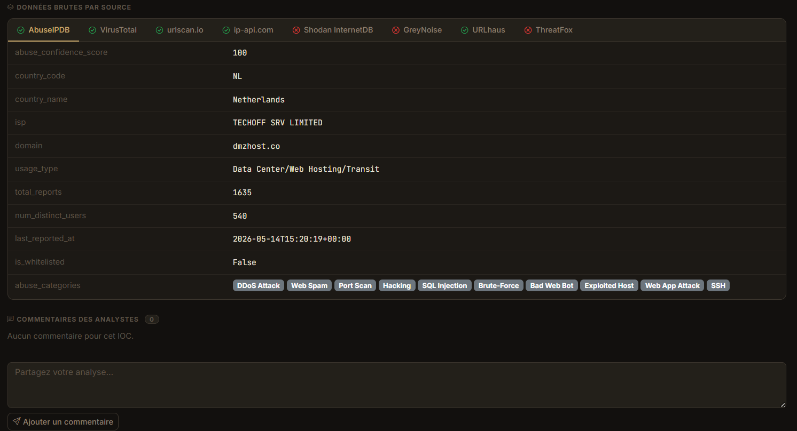
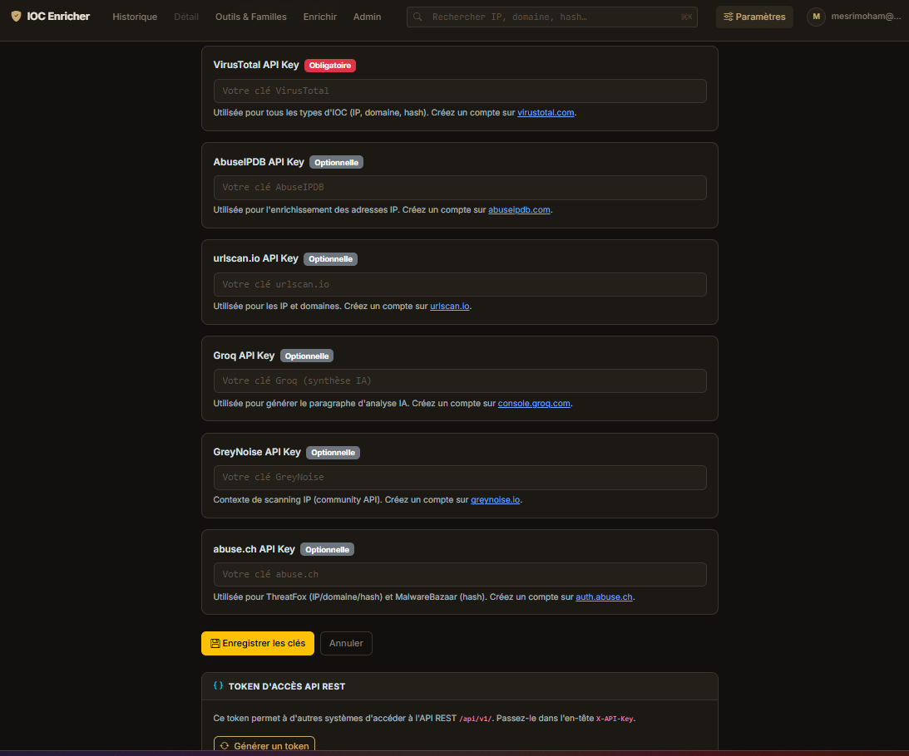
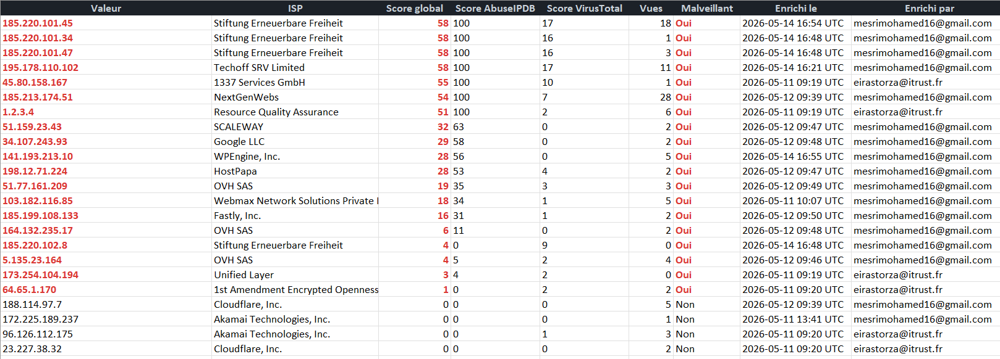

# IOC Enricher

> Plateforme de threat intelligence collaborative pour analystes SOC — enrichissement multi-sources, analyse IA et API REST.


---



---

## Table des matières

1. [Présentation](#présentation)
2. [Fonctionnalités](#fonctionnalités)
3. [Sources d'enrichissement](#sources-denrichissement)
4. [Captures d'écran](#captures-décran)
5. [Installation](#installation)
6. [Configuration](#configuration)
7. [Interface web](#interface-web)
8. [Mode CLI](#mode-cli)
9. [API REST](#api-rest)
10. [Auto-deploy GitHub → PythonAnywhere](#auto-deploy-github--pythonanywhere)
11. [Architecture du projet](#architecture-du-projet)
12. [Ajouter un enrichisseur](#ajouter-un-enrichisseur)
13. [Tests](#tests)

---

## Présentation

**IOC Enricher** est un outil open-source conçu pour les équipes SOC qui doivent qualifier rapidement des indicateurs de compromission (IOC). Il centralise la consultation de plusieurs plateformes de threat intelligence, calcule un score de menace agrégé et génère automatiquement un paragraphe d'analyse en français grâce à un LLM.

L'outil est utilisable de deux façons :

- **Interface web** — historique partagé, recherche, commentaires d'équipe, export Excel, API REST
- **CLI** — enrichissement rapide depuis le terminal, rapport HTML autonome en sortie

Toutes les APIs exploitées disposent d'un **free tier** : aucun abonnement payant requis.

---

## Fonctionnalités

### Enrichissement & analyse
- **9 sources de threat intelligence** interrogées automatiquement selon le type d'IOC
- **Score de menace 0–100** — combinaison pondérée AbuseIPDB + VirusTotal, clampé et normalisé
- **Synthèse IA adaptative** — paragraphe SOC en français généré par Groq (llama-3.3-70b-versatile), avec un prompt différent selon le type d'IOC (IP / domaine / hash) et son niveau de menace
- **Analyse hash avancée** — signature numérique, métadonnées PE, ExifTool, règles YARA, verdicts sandbox, graphe de relations complet
- **Détection des scanners** — badges rouges pour chaque antivirus ayant détecté l'IOC (VirusTotal)

### Interface & collaboration
- **Graphe de relations interactif** (vis-network) — hiérarchique pour les hashes, force-directed pour les IPs/domaines
- **Commentaires d'équipe** — annotations persistantes sur chaque fiche IOC, avec alerte si l'IOC a été ré-enrichi après le commentaire
- **Export Excel** — 3 feuilles (IPs / DOMAINs / HASHs), lignes malveillantes en rouge, scores détaillés
- **Cache intelligent** — résultats stockés en SQLite ; IOCs de moins de 14 jours servis depuis le cache avec indication de fraîcheur
- **TLP et tags** — classification TLP (WHITE / GREEN / AMBER / RED) et étiquettes libres par IOC
- **Verdict et famille de malware** — champs dédiés avec aide contextuelle intégrée

### Sécurité & administration
- **Gestion d'équipe** — inscription, approbation par l'admin, rôles (admin / analyste / en attente)
- **Clés API par utilisateur** — chaque analyste configure ses propres clés, chiffrées AES-128-GCM en base
- **Protection brute-force** — rate limiting sur `/login` (10 req/min, 30 req/h par IP)
- **En-têtes de sécurité** — HSTS, X-Frame-Options, X-Content-Type-Options, Referrer-Policy, cookies Secure/HttpOnly/SameSite
- **CSRF** sur tous les formulaires web ; API REST exemptée (authentification par token)

### Intégration & déploiement
- **API REST v1** — 4 endpoints JSON, auth par token personnel (`X-API-Key`)
- **Auto-deploy** — webhook GitHub qui déclenche `git pull` + rechargement PythonAnywhere automatiquement
- **Mode CLI** — fonctionne en script autonome sans base de données

---

## Sources d'enrichissement

### Couverture par type d'IOC

| Source | IP | Domaine | Hash | Clé requise | Quota gratuit |
|---|:---:|:---:|:---:|---|---|
| **AbuseIPDB** | ✅ | ❌ | ❌ | Oui | 1 000 req/jour |
| **VirusTotal** | ✅ | ✅ | ✅ | Oui | 500 req/jour |
| **ip-api.com** | ✅ | ❌ | ❌ | **Non** | Illimité |
| **urlscan.io** | ✅ | ✅ | ❌ | Oui | 1 000 req/jour |
| **Shodan InternetDB** | ✅ | ❌ | ❌ | **Non** | Illimité |
| **GreyNoise** | ✅ | ❌ | ❌ | Oui | Free tier |
| **URLhaus** (abuse.ch) | ✅ | ✅ | ❌ | Optionnel | Illimité |
| **ThreatFox** (abuse.ch) | ✅ | ✅ | ✅ | Optionnel | Illimité |
| **MalwareBazaar** (abuse.ch) | ❌ | ❌ | ✅ | Optionnel | Illimité |
| **Groq LLM** | ✅ | ✅ | ✅ | Oui | Free tier |

### Données extraites pour les hashes (VirusTotal)

| Catégorie | Données |
|---|---|
| **Identité** | Noms soumis, SHA256/SHA1/MD5, ssdeep/tlsh/vhash, taille, type MIME |
| **Dates** | Première/dernière soumission, nombre de sources distinctes |
| **Signature numérique** | Éditeur, émetteur, validité du certificat |
| **Métadonnées PE** | Date de compilation, imphash, sections (entropie haute flagguée) |
| **ExifTool** | CompanyName, ProductName, FileVersion, OriginalFilename |
| **Threat classification** | Label suggéré, catégories, noms de famille |
| **Sandboxes** | Verdicts multi-sandbox (VirusTotal MultiSandbox, Triage…) |
| **Règles YARA** | Règles communautaires correspondantes |
| **Graphe de relations** | Parents d'exécution, fichiers déposés, URLs/domaines/IPs contactés |

---

## Captures d'écran

### Formulaire d'enrichissement



---

### Fiche IOC — Analyse IA & score de menace



---

### Fiche IOC — Graphe de relations interactif



---

### Fiche IOC — Données brutes API & commentaires



---

### Gestion des clés API et token REST



---

### Export Excel



---

## Installation

### Prérequis

- Python 3.10 ou supérieur
- pip

### 1. Cloner le dépôt

```bash
git clone https://github.com/Mohamed-hub16/ioc-enricher.git
cd ioc-enricher
```

### 2. Créer un environnement virtuel (recommandé)

```bash
python3 -m venv .venv
source .venv/bin/activate      # Linux / macOS
.venv\Scripts\activate         # Windows
```

### 3. Installer les dépendances

```bash
pip install -r requirements.txt
```

### 4. Configurer les variables d'environnement

```bash
cp .env.example .env
```

Puis remplir `.env` — voir la section [Configuration](#configuration) ci-dessous.

### 5. Lancer l'application

```bash
python3 app.py
# → http://localhost:5000
```

**Premier lancement :** créez un compte avec l'email défini dans `ADMIN_EMAIL` — il obtient automatiquement les droits administrateur.

---

## Configuration

Toutes les variables sont définies dans `.env` (copié depuis `.env.example`) :

```env
# === APIs d'enrichissement ===
ABUSEIPDB_API_KEY=          # https://www.abuseipdb.com/account/api
VIRUSTOTAL_API_KEY=         # https://www.virustotal.com/gui/my-apikey
URLSCAN_API_KEY=            # https://urlscan.io/user/signup
GROQ_API_KEY=               # https://console.groq.com/keys
GREYNOISE_API_KEY=          # https://www.greynoise.io/ (free tier)
ABUSE_CH_API_KEY=           # ThreatFox + MalwareBazaar — https://auth.abuse.ch/

# Shodan InternetDB et ip-api.com ne nécessitent aucune clé

# === Flask ===
SECRET_KEY=                 # python3 -c "import secrets; print(secrets.token_hex(32))"
ADMIN_EMAIL=                # cet email obtient automatiquement le rôle admin à l'inscription
FLASK_ENV=development       # mettre "production" sur un serveur public

# === Auto-deploy (optionnel) ===
DEPLOY_SECRET=              # secret défini dans GitHub → Settings → Webhooks
PA_API_TOKEN=               # PythonAnywhere → Account → API token
PA_USERNAME=                # votre username PythonAnywhere
PA_DOMAIN=                  # ex: username.pythonanywhere.com
```

> Toutes les APIs d'enrichissement sont **gratuites**. Les clés ABUSE_CH sont optionnelles (améliore les résultats pour ThreatFox/MalwareBazaar). Shodan InternetDB et ip-api.com fonctionnent sans clé.

### Obtenir les clés API

| Service | Lien d'inscription |
|---|---|
| AbuseIPDB | https://www.abuseipdb.com/account/api |
| VirusTotal | https://www.virustotal.com/gui/my-apikey |
| urlscan.io | https://urlscan.io/user/signup |
| Groq | https://console.groq.com/keys |
| GreyNoise | https://www.greynoise.io/ |
| abuse.ch (ThreatFox / MalwareBazaar) | https://auth.abuse.ch/ |

---

## Interface web

```bash
python3 app.py
# → http://localhost:5000
```

### Niveaux d'accès

| Action | Anonyme | Analyste approuvé | Admin |
|---|:---:|:---:|:---:|
| Consulter l'historique des IOCs | ✅ | ✅ | ✅ |
| Rechercher / filtrer | ✅ | ✅ | ✅ |
| Soumettre / enrichir un IOC | ❌ | ✅ | ✅ |
| Re-enrichir (forcer la mise à jour) | ❌ | ✅ | ✅ |
| Exporter en Excel | ❌ | ✅ | ✅ |
| Commenter un IOC | ❌ | ✅ | ✅ |
| Utiliser l'API REST | ❌ | ✅ | ✅ |
| Supprimer un IOC | ❌ | ❌ | ✅ |
| Approuver / révoquer des comptes | ❌ | ❌ | ✅ |
| Régénérer les analyses IA en masse | ❌ | ❌ | ✅ |

### Gestion des collègues

Vos collègues s'inscrivent sur `/register`. Vous les approuvez depuis **Admin** dans la barre de navigation. Les comptes non approuvés peuvent consulter l'historique mais ne peuvent pas enrichir ni commenter.

### Clés API par utilisateur

Chaque analyste configure ses propres clés API dans **Paramètres** → **Clés API**. Elles sont stockées chiffrées en base (AES-128-GCM). Les comptes administrateurs utilisent les clés globales du `.env`.

### Export Excel

Le bouton **Exporter Excel** génère un fichier `ioc_export_YYYYMMDD_HHMM.xlsx` avec 3 feuilles :

| Colonne | Description |
|---|---|
| Valeur | L'IOC |
| Score global | Score 0–100 (combiné AbuseIPDB + VirusTotal) |
| Score AbuseIPDB | Confidence score brut (vide pour les hashes) |
| Score VirusTotal | Ratio de détections en % |
| Vues | Nombre de consultations de la fiche |
| Malveillant | Oui / Non |
| Enrichi le | Date et heure d'enrichissement |
| Enrichi par | Email de l'analyste |

Les IOCs malveillants apparaissent en surbrillance rouge.

---

## Mode CLI

Le mode CLI ne nécessite pas de base de données. Il génère un rapport HTML autonome.

```bash
# IOC unique
python3 main.py --ioc 8.8.8.8

# Plusieurs IOCs (IPs, domaines, hashes mélangés)
python3 main.py --ioc 1.2.3.4 evil.example.com d41d8cd98f00b204e9800998ecf8427e

# Depuis un fichier (un IOC par ligne)
python3 main.py --file iocs.txt

# Chemin de sortie personnalisé
python3 main.py --file iocs.txt --output rapport.html

# Désactiver la synthèse IA (plus rapide)
python3 main.py --ioc 1.2.3.4 --no-ai
```

Les rapports sont sauvegardés dans `output/<YYYYMMDD_HHMMSS>.html` par défaut.

> Pour un enrichissement en volume (100+ IOCs d'un coup), le mode CLI ou l'API REST (`POST /api/v1/enrich`) sont préférables à l'interface web.

---

## API REST

L'API REST permet d'intégrer IOC Enricher dans vos outils existants (SIEM, scripts de réponse à incident, notebooks Jupyter…).

### Authentification

1. Connectez-vous → **Paramètres** (navbar) → section **Token d'accès API REST**
2. Cliquez **Générer un token** — copiez-le immédiatement *(il est affiché une seule fois)*
3. Passez-le dans l'en-tête `X-API-Key` de chaque requête

### Endpoints

| Méthode | URL | Rôle requis | Description |
|---|---|---|---|
| `GET` | `/api/v1/iocs` | Analyste | Liste paginée avec filtres |
| `GET` | `/api/v1/ioc/<valeur>` | Analyste | Détail complet + données brutes + paragraphe IA |
| `POST` | `/api/v1/enrich` | Analyste | Enrichir un IOC (utilise vos clés API) |
| `DELETE` | `/api/v1/ioc/<valeur>` | Admin | Suppression d'un IOC et ses commentaires |

### Paramètres de `GET /api/v1/iocs`

| Paramètre | Type | Défaut | Description |
|---|---|---|---|
| `q` | string | — | Recherche libre sur la valeur de l'IOC |
| `type` | `ip` \| `domain` \| `hash` | tous | Filtrer par type |
| `min_score` | entier 0–100 | — | Score minimum |
| `sort` | `date` \| `score` \| `views` | `date` | Critère de tri |
| `page` | entier | `1` | Numéro de page |
| `per_page` | entier 1–200 | `50` | Résultats par page |

### Exemples

**bash / curl**

```bash
export TOKEN="votre_token_api"
export BASE="https://votre-domaine.com/api/v1"

# Lister les IPs malveillantes (score ≥ 50), triées par score décroissant
curl -H "X-API-Key: $TOKEN" \
     "$BASE/iocs?type=ip&min_score=50&sort=score&per_page=100"

# Détail complet d'un IOC
curl -H "X-API-Key: $TOKEN" \
     "$BASE/ioc/8.8.8.8"

# Enrichir un IOC (cache si < 14 jours)
curl -X POST \
     -H "X-API-Key: $TOKEN" \
     -H "Content-Type: application/json" \
     -d '{"ioc": "malware.example.com"}' \
     "$BASE/enrich"

# Forcer le re-enrichissement (ignorer le cache)
curl -X POST \
     -H "X-API-Key: $TOKEN" \
     -H "Content-Type: application/json" \
     -d '{"ioc": "malware.example.com", "force": true}' \
     "$BASE/enrich"
```

**Python**

```python
import requests

BASE = "https://votre-domaine.com/api/v1"
HEADERS = {"X-API-Key": "votre_token_api"}

# Récupérer toutes les IPs malveillantes (score > 0)
response = requests.get(
    f"{BASE}/iocs",
    headers=HEADERS,
    params={"type": "ip", "min_score": 1, "sort": "score", "per_page": 200}
)
for ioc in response.json()["iocs"]:
    print(f"{ioc['value']:20s}  score={ioc['threat_score']:3d}  {ioc['malware_family'] or ''}")

# Enrichir une liste d'IOCs en masse
iocs_to_check = ["1.2.3.4", "evil.example.com", "d41d8cd98f00b204e9800998ecf8427e"]
for value in iocs_to_check:
    r = requests.post(f"{BASE}/enrich", headers=HEADERS, json={"ioc": value})
    data = r.json()
    status = "CACHE" if data.get("cached") else "ENRICHI"
    print(f"[{status}] {value} — score {data.get('threat_score', '?')}")
```

---

## Auto-deploy GitHub → PythonAnywhere

Le webhook `/webhook/deploy` automatise le déploiement : à chaque push sur `main`, GitHub déclenche un `git pull` puis recharge l'application web.

### 1. Générer un secret webhook

```bash
python3 -c "import secrets; print(secrets.token_hex(32))"
```

Ajouter dans `.env` :

```env
DEPLOY_SECRET=<valeur_générée>
```

### 2. Configurer le token PythonAnywhere

**PythonAnywhere** → **Account** → onglet **API token** → copier le token.

```env
PA_API_TOKEN=<token_pythonanywhere>
PA_USERNAME=<votre_username>
PA_DOMAIN=<votre_username>.pythonanywhere.com
```

### 3. Configurer le webhook GitHub

**GitHub** → votre repo → **Settings** → **Webhooks** → **Add webhook** :

| Champ | Valeur |
|---|---|
| Payload URL | `https://<PA_DOMAIN>/webhook/deploy` |
| Content type | `application/json` |
| Secret | la valeur de `DEPLOY_SECRET` |
| Which events | **Just the push event** |

La signature HMAC-SHA256 est vérifiée à chaque appel — les requêtes sans signature valide sont rejetées avec un 403.

---

## Architecture du projet

```
app.py                    # Point d'entrée Flask
main.py                   # Point d'entrée CLI
webapp/
  __init__.py             # Factory Flask (SQLAlchemy, CSRF, LoginManager, rate limiting)
  models.py               # Modèles SQLAlchemy : User, IOCRecord, Comment
  auth.py                 # /login  /register  /logout  /settings/api-keys
                          # /settings/api-token/generate|revoke
  ioc_routes.py           # /  /ioc/<valeur>  /enrich  /export/excel
                          # /ioc/<valeur>/delete  /ioc/<valeur>/comment
                          # /pivot/family/<famille>
  admin_routes.py         # /admin/users  /admin/regenerate-paragraphs
  deploy_routes.py        # /webhook/deploy  (auto-deploy GitHub)
  api_routes.py           # /api/v1/  (REST API — auth X-API-Key, CSRF-exempt)
  templates/              # Jinja2 + Bootstrap 5 dark theme
src/
  enrichers/              # Un module par source (abuseipdb, virustotal, ipapi,
                          # urlscan, shodan_internetdb, greynoise, urlhaus,
                          # threatfox, malwarebazaar)
  parsers/                # Détection automatique du type d'IOC (IP / domaine / hash)
  synthesis/              # Génération du paragraphe IA via Groq
  models.py               # Dataclasses partagés (IOC, EnrichmentResult)
instance/                 # Base SQLite — ignorée par git
output/                   # Rapports HTML CLI — ignorés par git
```

### Modèles de données

**`User`** — id, email, password_hash (bcrypt), role (`admin` | `analyst` | `pending`), created_at, rest_api_key_hash, virustotal/abuseipdb/urlscan/groq/greynoise/abusech\_key\_enc

**`IOCRecord`** — id, value, ioc_type, enriched_at, enriched_by, raw_results (JSON), paragraph, threat_score, view_count, verdict, malware_family, tlp, tags_json, score_breakdown_json

**`Comment`** — id, ioc_record_id (FK), author, content, created_at, enriched_at_snapshot

### Calcul du score de menace

```
IP / domaine :  round(abuse_confidence × 0.5  +  vt_detection_ratio × 0.5)
Hash         :  round(vt_detection_ratio × 100)   # AbuseIPDB ne couvre pas les hashes
Résultat     :  clampé dans [0, 100]
```

Un IOC est considéré **malveillant** si son score est > 0.

---

## Ajouter un enrichisseur

L'interface est volontairement simple. Pour brancher une nouvelle source :

1. Créer `src/enrichers/<nom>.py` avec une fonction `enrich(ioc: IOC) -> EnrichmentResult`
2. L'enregistrer dans `src/enrichers/__init__.py` sous `ENRICHERS_BY_TYPE`
3. Ajouter la variable de clé dans `.env.example`

```python
# src/enrichers/mon_api.py
from src.models import IOC, EnrichmentResult
import httpx

def enrich(ioc: IOC, api_key: str = "") -> EnrichmentResult:
    # ...
    return EnrichmentResult(source="MonAPI", data={...})
```

---

## Tests

```bash
pytest tests/
```

---

## Licence

Ce projet est distribué sous licence **MIT**. Voir le fichier `LICENSE` pour les détails.

---

*Développé pour les équipes SOC — contributions bienvenues.*
